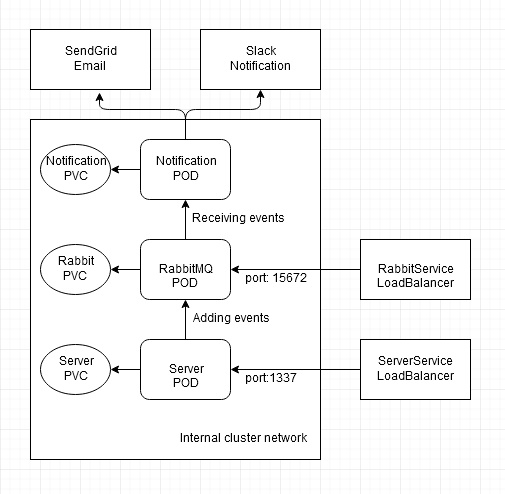

# kubernetes Orchestration
The idea is to orchestrate microservices in Kubernetes. Please find the other repositories (https://github.com/mail4hafij/rabbit_event_stream, and https://github.com/mail4hafij/notification_service). Rabbit-event-stream repo, is a webserver which adds events to RabbitMQ. The Notification-service repo, is a console app which sends slack notification and sends out emails using SendGrid API. In this project, we are going to orchestrate both those microservices into Kubernetes. The example here covers, deployment to the local docker kubernetes service. So make appropriate changes when deploying to production clusters (i.e., Azure Managed Kubernetes).

# Changes you need to do
  1. Update the settings.dev.json and settings.prod.json files in the repo https://github.com/mail4hafij/notification_service with your SendGrid api key and your link to Slack channel.
  2. Change the storage class type in storage-class.yaml with your prefered storage class type.
  3. Make appropriate changes to PVCs in rabbit_event_stream/rabbit-pvc.yaml, rabbit_event_stream/server-pvc.yaml and notification_service/notification-pvc.yaml according to your storage needs.
  4. Build an image for the rabbit server pod (that is publishing events to rabbitMQ) and push it to your favorit image/container repository.
  5. Build an image for the notification_service pod and push it to your favorit image/container repository.
  6. Update the rabbit server image location in the rabbit_event_stream/server-deployment.yaml file (for now it is using my public image for rabbit_event_stream_server in dockerHub).
  7. Point the notification_service image in the notification_service/notificaiton-deployment.yaml file (for now it is using my public image for notification_service_src in dockerHub). 
  
 Done!  
 
 
